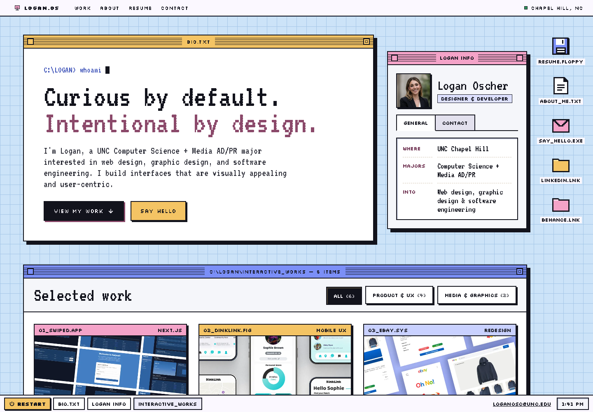

# Portfolio design explorations

Alternate designs for the portfolio, kept separate from the live site repo (loganosc/portfolio → loganoscher.com).

| Folder | Design |
|---|---|
| `/` (repo root) | Snapshot of the current live site |
| [`designs/dual/`](designs/dual/) | "Dual": Retro OS file-browser layout |
| [`designs/pastel-os/`](designs/pastel-os/) | "Pastel OS": Retro OS workspace layout |
| [`designs/logan-os/`](designs/logan-os/) | "Logan.os": Full-bleed retro desktop with a CRT intro |
| [`designs/original/`](designs/original/) | "Original": Copy of the live site ([loganosc/portfolio](https://github.com/loganosc/portfolio) @ `06a07ae`) |

All designs pull images and case-study pages from the root `assets/` folder, so open them from inside this repo (e.g. `open designs/pastel-os/index.html`).

## Dual

A System 7-style Finder window. A bio inspector panel sits above a project browser with a sidebar of volumes (Product & UX, Media & Graphics, About, Resume), large-grid/compact-list view modes, and tag filtering.


**Editing Dual:** styles are prebuilt with Tailwind, and the case-study modals are generated from the root `*-case-study.html` pages.

```bash
cd designs/dual
npm install          # first time only
npm run build        # after changing Tailwind classes in index.html
npm run sync         # after editing a root case-study page (also updates Logan.os)
```

## Pastel OS

A pastel workspace window with a large intro headline, a "verify humanity" widget, and a searchable project directory with tag filters and color-coded "Launch Specs" cards.


## Logan.os

A full-bleed retro desktop: a menu bar, bio and "Logan Info" windows, a filterable Interactive_Works window, desktop file icons, and a taskbar with a live clock. On the first visit of a session, the site appears inside a beige CRT, a pixel cursor clicks the screen, and the camera zooms in. The taskbar's Restart button replays it; phones skip it. Projects open in a themed case-study viewer. Plain HTML/CSS/JS with no build step; after editing a root case-study page, run `python3 scripts/sync_case_studies.py`.



## Original

A saved copy of the live portfolio from [loganosc/portfolio](https://github.com/loganosc/portfolio) at commit `06a07ae`: the dark hero with the serif statement, the featured projects and the four case-study pages. Only the pages, CSS and JS are copied; image and PDF links point at the shared root `assets/` folder (identical to the live repo's), so the copy adds no duplicate media.
