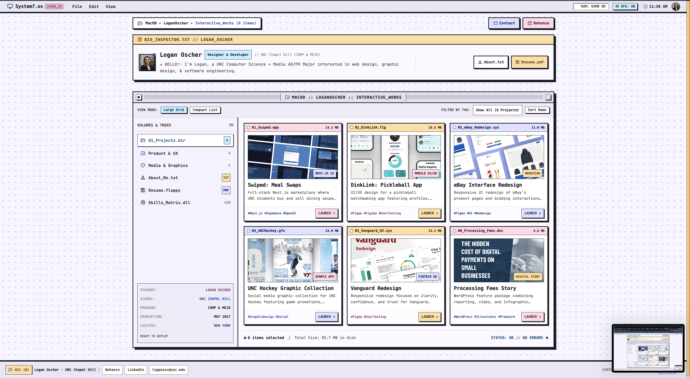
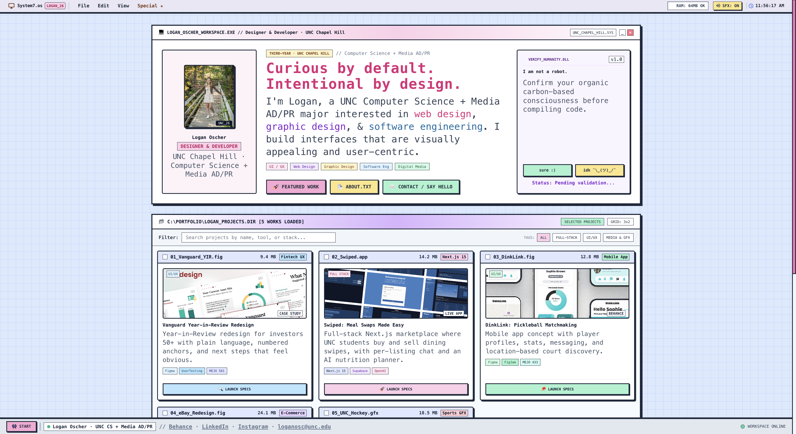

# Portfolio design explorations

Alternate designs for the portfolio, kept on the `designs` branch so they don't deploy to loganoscher.com.

| Folder | Design |
|---|---|
| `/` (repo root) | Current live site |
| [`designs/dual/`](dual/) | "Dual": Retro OS file-browser layout |
| [`designs/pastel-os/`](pastel-os/) | "Pastel OS": Retro OS workspace layout |

Both designs pull images and case-study pages from the root `assets/` folder, so open them from inside this repo (e.g. `open designs/pastel-os/index.html`).

## Dual

A System 7-style Finder window. A bio inspector panel sits above a project browser with a sidebar of volumes (Product & UX, Media & Graphics, About, Resume), large-grid/compact-list view modes, and tag filtering.

## Pastel OS

A pastel workspace window with a large intro headline, a "verify humanity" widget, and a searchable project directory with tag filters and color-coded "Launch Specs" cards.

